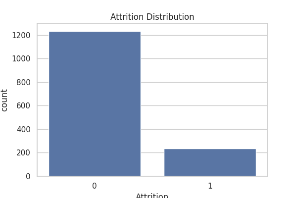
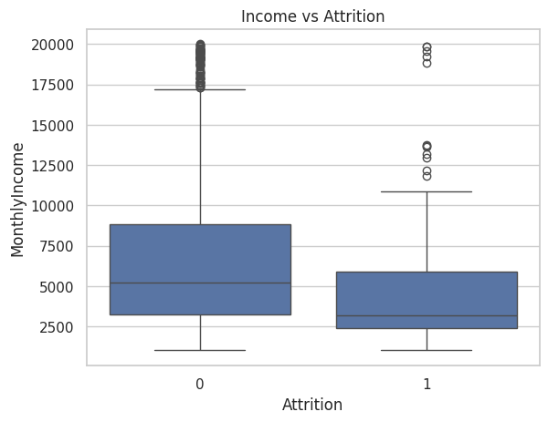
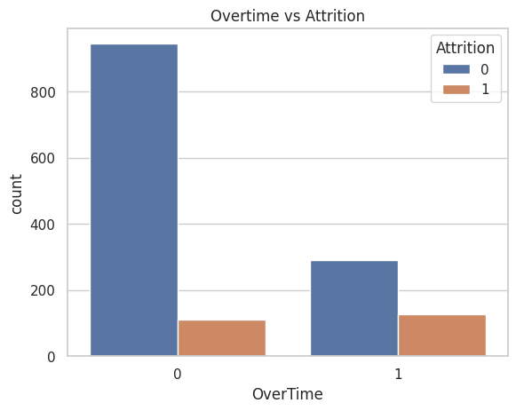
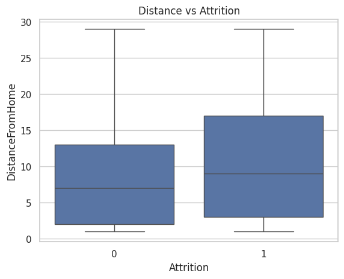
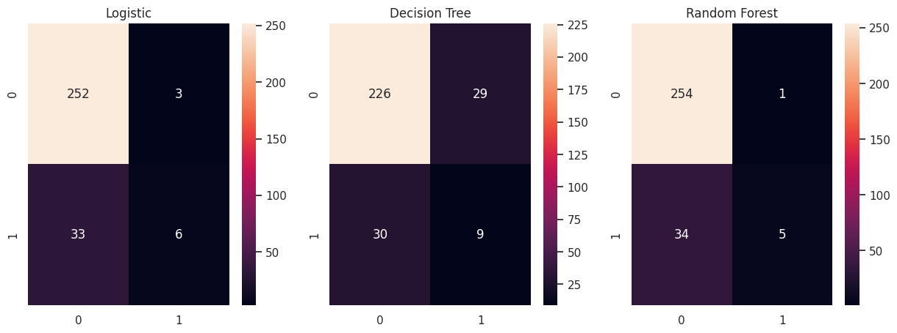
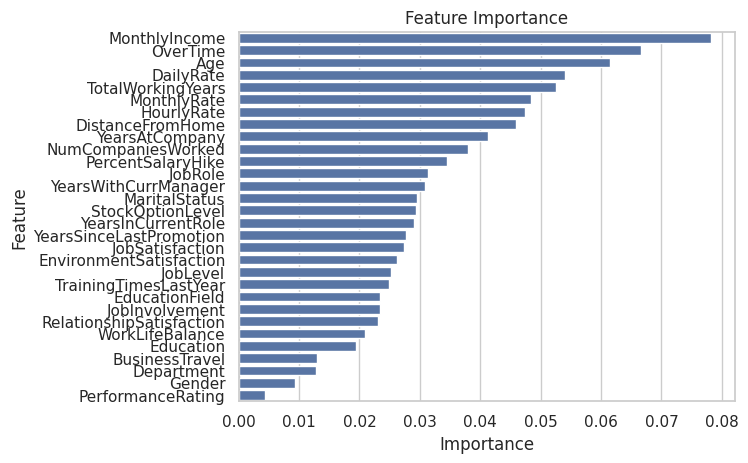

# 🚀 Strategic Employee Attrition Risk Analytics

## 📌 Executive Summary

Employee attrition is a critical business risk that impacts productivity, talent retention, and operational costs. Traditional HR approaches are reactive, addressing attrition only after employees leave.

This project leverages **Machine Learning and People Analytics** to predict employee attrition and uncover key workforce risk drivers, enabling organizations to take **proactive, data-driven retention actions**.

---
## ❗ Problem Statement

Employee attrition represents a significant workforce risk, impacting organizational performance, operational continuity, and financial stability.

Traditional HR approaches are reactive, addressing turnover only after it occurs. This limits an organization's ability to retain talent and increases the cost of workforce replacement.

The challenge is to develop a predictive system that can:

- Identify employees at high risk of attrition  
- Understand the key drivers behind turnover  
- Enable proactive, data-driven retention strategies  

This project applies machine learning techniques to transform HR data into actionable workforce intelligence.
## 🎯 Business Objectives

* Predict employees at high risk of leaving
* Identify key drivers behind attrition
* Enable proactive HR decision-making
* Reduce costs associated with hiring and turnover

---

## 📊 Dataset

This project uses the **IBM HR Analytics Employee Attrition Dataset**, containing rich employee-level data:

* **Demographics:** Age, Gender
* **Financials:** MonthlyIncome
* **Employment Metrics:** YearsAtCompany, JobRole, Department, OverTime
* **Behavioral Factors:** JobSatisfaction, EnvironmentSatisfaction, WorkLifeBalance
* **Other Features:** DistanceFromHome, Education, MaritalStatus

🎯 **Target Variable:**

* Attrition (0 = Stayed, 1 = Left)

---

## ⚙️ Methodology

### 🔹 Data Preprocessing & Feature Engineering

* Cleaned dataset and handled missing values
* Removed irrelevant columns
* Encoded categorical variables using Label Encoding
* Applied **feature scaling (StandardScaler)** to normalize numerical features
* Addressed **class imbalance using SMOTE (Synthetic Minority Over-sampling Technique)**
* Performed 80/20 train-test split (`random_state=42`)

---

### 🔹 Modeling Pipeline

A structured machine learning pipeline was implemented:

1. Data preprocessing
2. Feature scaling
3. Class imbalance handling (SMOTE)
4. Model training
5. Evaluation using advanced metrics

---

## 🤖 Models Implemented

| Model               | Purpose                    |
| ------------------- | -------------------------- |
| Logistic Regression | Baseline interpretability  |
| Decision Tree       | Explainable decision logic |
| Random Forest       | Production-ready model     |

---

## 📈 Model Evaluation

Due to class imbalance in the dataset, multiple evaluation metrics were used:

* Accuracy
* Precision
* Recall
* F1 Score
* ROC AUC Score
* Confusion Matrix

### 🎯 Key Evaluation Insight:

* **Recall is critical**, as it measures the model’s ability to correctly identify employees who are likely to leave
* **ROC AUC** evaluates how well the model distinguishes between attrition and non-attrition cases

The **Random Forest model** achieved the best balance between precision and recall, making it the most suitable for production deployment.

---

## ⚖️ Handling Class Imbalance

The dataset showed a significant imbalance between employees who stayed and those who left.

To address this:

* Applied **SMOTE (Synthetic Minority Over-sampling Technique)** on training data

### 📌 Impact:

* Improved detection of attrition cases
* Reduced bias toward majority class
* Increased model reliability

---

## 📏 Feature Scaling

Numerical features were standardized using **StandardScaler**.

### 📌 Why this matters:

* Improves convergence of Logistic Regression
* Enhances model stability
* Ensures consistent feature contribution

---

## 📊 Exploratory Data Analysis

### 📌 Attrition Distribution



### 📌 Monthly Income vs Attrition



### 📌 Overtime vs Attrition



### 📌 Distance from Home vs Attrition



---

## 📉 Confusion Matrix Comparison



---

## 🔍 Feature Importance (Attrition Drivers)



### 🔑 Top Predictors:

* MonthlyIncome
* Age
* OverTime
* DistanceFromHome
* JobSatisfaction

---

## 🧠 Key Insights

* 💰 **Low Income → Higher Attrition Risk**
* ⏱ **OverTime → Strong Burnout Indicator**
* 🚗 **Long Commute → Hidden Retention Risk**
* 😊 **Low Job Satisfaction → High Exit Probability**
* 👶 **Early Tenure Employees → Higher Turnover**
* ⚖️ **Class balancing improved detection of at-risk employees**

---

## 💼 Business Recommendations

### 1. Compensation Optimization

Adjust salary structures for high-risk employees.

### 2. Burnout Reduction Strategy

Monitor and manage overtime workloads.

### 3. Early Retention Programs

Focus on employees within their first 2–3 years.

### 4. Employee Engagement

Improve job satisfaction and work-life balance initiatives.

---

## 🚀 Business Impact

* Enables proactive attrition prevention
* Improves detection of high-risk employees
* Reduces recruitment and onboarding costs
* Enhances workforce stability
* Supports data-driven HR decision-making

---

## 🧠 Logistic Regression Insight

Logistic Regression provided strong interpretability, allowing clear understanding of feature impact on attrition probability. However, due to its linear assumptions, it was less effective in capturing complex patterns compared to ensemble models.

👉 Best suited for **interpretability**, not production deployment.

---

## 🧰 Technology Stack

* **Python**
* **pandas, numpy**
* **scikit-learn**
* **imbalanced-learn (SMOTE)**
* **matplotlib, seaborn**

---

## 📁 Project Structure

```
Employee-Attrition-Risk-Analysis/
│
├── notebooks/
│   └── attrition_analysis.ipynb
│
├── images/
│   ├── attrition_distribution.png
│   ├── income_attrition.png
│   ├── overtime_attrition.png
│   ├── distance_attrition.png
│   ├── confusion_matrix.png
│   └── feature_importance.png
│
├── data/
│   └── WA_Fn-UseC_-HR-Employee-Attrition.csv
│
└── README.md
```

---

## 🔮 Future Enhancements

* SHAP explainability for model transparency
* Streamlit dashboard for interactive HR insights
* Integration with HR systems for real-time predictions

---

## 👤 Author

**Murad Amin**  🔗 [LinkedIn](https://www.linkedin.com/in/muradamin) | 🔗 [GitHub](https://github.com/Muradamen)
Data Scientist | AI & People Analytics

Passionate about building intelligent systems that solve real-world business problems and drive data-driven decision-making.

---

## ⭐ If you found this project useful, consider giving it a star!


